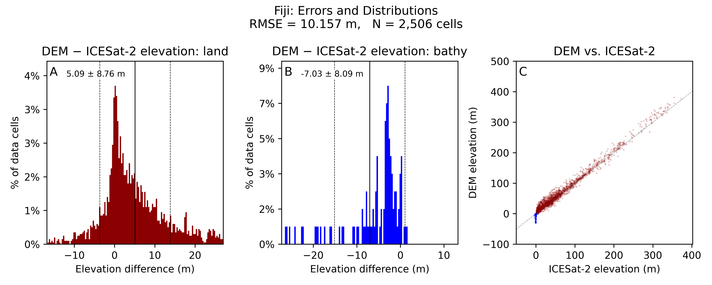

Day 2 builds on the Fiji test DEM and YAML walkthrough from Day 1. Now that participants have seen how a complete DEM recipe is structured, the goal is to step through the main workflow tools more directly and then run a custom region using `globato`.

By the end of Day 2, participants should understand how `fetchez`, `transformez`, `globato`, and IVERT fit together in a reproducible coastal DEM workflow. Participants should be able to discover source data, understand vertical transformation needs, run or modify a recipe, inspect generated DEM outputs, and consider basic validation and quality-control questions.

## Learning Goals

By the end of this section, participants should be able to:

- Reactivate the `cudem` environment
- Confirm that the main CUDEM tools are still working
- Understand the role of `fetchez` in data discovery and source-data access
- Understand the role of `transformez` in vertical harmonization
- Understand how `globato` connects the CUDEM workflow
- Run or inspect a custom DEM recipe with `globato`
- Understand the role of `ivert` in independent DEM validation
- Review DEM outputs and identify basic quality-control issues
- Understand how a Fiji-style workflow can be adapted to another coastal region

---

## Reactivate the CUDEM Environment

Open a Miniforge Prompt or terminal and reactivate the workshop environment:

```bash
conda activate cudem
```

Confirm that the main tools are available:

```bash
fetchez --help
transformez --help
globato --help
ivert --help
```

If these commands return help text, the environment is ready for the Day 2 exercises.

---

## Independent DEM Validation with IVERT

[ICESat-2](https://icesat-2.gsfc.nasa.gov/) is a NASA satellite mission, launched in 2018, that measures the elevation of Earth's surface using a space-based laser altimeter (ATLAS). As it orbits, it collects billions of precisely geolocated elevation measurements ("photons") across the globe, providing an independent, high-accuracy record of surface heights over land, ice, water, and coastal zones. IVERT (the Icesat-2 Validation of Elevations Reporting Tool) uses these measurements as an independent reference: because ICESat-2 data are collected separately from the source data used to build a DEM, they can be compared against the DEM's elevations to quantify vertical accuracy and identify errors, biases, and problem areas. This gives us a trustworthy, satellite-derived "ground truth" for validating coastal DEMs anywhere on Earth.

By the end of this session, users should be able to:

- Use ICESat-2 data to generate plots and statistics describing the approximate accuracy of their DEMs against satellite-based lidar measurements.
- Use those results to pinpoint regions of their DEM where errors may be larger and could use some attention.
- Determine where ICESat-2 may be giving erroneous data and mask those areas to improve the accuracy of results.
- Download and classify ICESat-2 data in a new region to perform future validations over other areas.

This section covers:

- The purpose of independent DEM validation and where it fits in the CUDEM workflow
- Required inputs and expected outputs
- Running the Fiji test DEM through `ivert`
- Filtering and interpreting the validation results
- Setting up custom validations for your own DEMs

### Explore IVERT

Start by viewing the commands that `ivert` provides. Run:

```bash
ivert --help
```

This lists the available subcommands and options. Take a moment to see what `ivert` can do before running it.

### Set Up IVERT

Next, set up IVERT on your machine:

```bash
ivert setup
```

This creates a `.ivert` folder in your home directory, where IVERT stores its data. It will also prompt you for whether you want to enter NASA EarthData credentials, which IVERT uses to fetch and subset ICESat-2 data.

For today's module, you do **not** need a NASA EarthData account: we will be using pre-downloaded and classified ICESat-2 data over Fiji, so you can skip the credential prompt and continue.

If you would like to run your own validations later and haven't set up EarthData credentials yet, see the [NASA EarthData Credentials section in Module 2](#nasa-earthdata-credentials).

### The IVERT Database

Before IVERT can validate a DEM, it needs a local database of ICESat-2 measurements covering your region of interest. Normally you would build this with the `ivert database download` command, which fetches fresh ICESat-2 data from NASA's EarthData repository and classifies it (identifying ground, water, and bathymetry photons) for use as validation points. For a real region, this download and classification step can take 1–2 hours, and longer for a large area.

To keep this tutorial moving, we will instead download and install a pre-compiled IVERT database over our Fiji DEM. This dataset covers all ICESat-2 data collected from **November 1, 2022 through November 1, 2024**.

We currently cut the data off in early November 2024 because the ATL24 bathymetry product has only been processed through that date, and ATL24 is what lets IVERT classify ICESat-2 bathymetry (below-water) measurements. A new ATL24 processing phase is scheduled for Fall 2026 that will extend ATL24 coverage up to the present; until then, this is the latest date from which we can classify bathymetry data from ICESat-2.

If you would like to build your own database over another region, follow the instructions in the [Build an IVERT Database](#build-an-ivert-database) section below, which explains how to download and classify ICESat-2 data yourself.

### Install the Pre-Compiled Fiji Database

Download the pre-compiled Fiji database from the workshop's GitHub release into your IVERT data directory:

```bash
wget -P ~/.ivert/icesat2 https://github.com/continuous-dems/workshop-gebco-2026/releases/download/ivert-data-v1/ivert_granules_fiji.zip
```

Then unzip it in place:

```bash
unzip ~/.ivert/icesat2/ivert_granules_fiji.zip -d ~/.ivert/icesat2
```

This places the granules database (`icesat2_granules_database.gpkg`) and a `granules/` folder of classified ICESat-2 photon files directly into `~/.ivert/icesat2/`, where IVERT expects to find them. Confirm the files are in place:

```bash
ls ~/.ivert/icesat2
ls ~/.ivert/icesat2/granules
```

You should see `icesat2_granules_database.gpkg` alongside a `granules/` directory containing the classified `.nc` granules. IVERT is now ready to validate the Fiji DEM against this pre-loaded ICESat-2 data.

> **Windows users:** If `wget` or `unzip` aren't available in your Miniforge Prompt, you can download the zip by pasting the URL above into a browser and then extract it into `%USERPROFILE%\.ivert\icesat2\` with File Explorer.

### Validate Your DEM

With the Fiji database installed, you're ready to validate a DEM. First, look at the options `ivert validate` provides:

```bash
ivert validate --help
```

In its simplest form, `ivert validate` takes one or more GeoTIFF DEMs (or a directory or glob of `.tif` files) and compares each one against the ICESat-2 photons in your database:

```bash
ivert validate fiji_test_final.tif -V egm2008 -n "Fiji" -mc
```

A few of the most important options to know:

- **`-V, --vdatum`** — the vertical datum of your DEM (for example `egm2008`, `navd88`, `mllw`, or an EPSG code like `3855`). This one matters: IVERT has to put the DEM and the ICESat-2 measurements on the same vertical reference before it can compare them. If you leave it off, IVERT reads the datum from the DEM's metadata header — so pass it explicitly if you're not sure whether the vertical datum will be read correctly from your DEM's header data. Run `ivert validate --list-vdatums` to see all recognized names.
- **`-n, --name`** — a readable region name that appears on the output plots (it defaults to the DEM's filename).
- **`-ex, --exclude`** — exclude ICESat-2 photons inside a given zone before validating. This is how you mask out areas where ICESat-2 itself is returning bad data (for example over cloud-contaminated or surf-heavy areas). Each use takes either a bounding box in the DEM's own projection (`minx/maxx/miny/maxy`, i.e. west/east/south/north — the same ordering the `ivert database` commands use) or a vector file (`.shp`, `.geojson`, `.gpkg`) of exclusion polygons, and you can repeat the flag to combine multiple zones.
- **`-mc, --measure-coverage`** — measure how densely ICESat-2 sampled each grid cell (the fraction of sub-regions within a cell that actually contain photons). This is used primarily to account for **sampling bias**: in a coarse cell, ICESat-2 may only touch a small portion of the ground, so the reported error reflects just that sampled sliver rather than the whole cell. Coverage is typically ignored for higher-resolution (sub-10 m) DEMs, where each cell is small enough that partial sampling matters little. But because we are gridding at 3 arc-seconds (roughly 90 m on the ground), it's worth measuring here. With coverage measured, IVERT can also report RMSE broken down by coverage decile, and you can drop poorly-sampled cells with `-mcp, --minimum-coverage-pct`.

When it finishes, IVERT writes its results into an `ivert_results/` subdirectory, created relative to the directory where your DEM is stored. (You can send them somewhere else with the `-o, --outdir` option.) These outputs include summary statistics, plots, and per-cell error layers, which we'll inspect next.

### Explore Your IVERT Results

Open the `ivert_results/` subdirectory next to your DEM to see what IVERT produced. Because we validated `fiji_test_final.tif`, every output here is prefixed with `fiji_test_final`. Let's walk through each file in turn.

#### 1. The results database (`fiji_test_final_results.h5`)

This is an [HDF5](https://www.hdfgroup.org/solutions/hdf5/) database holding the raw, per-grid-cell validation results from IVERT: the elevation difference in each cell, the number of photons used, roughness, and other per-cell measurements. You don't typically need to open this file directly — but it's worth knowing that **every other output in this directory is derived from it**. The summary statistics, the plot, and the error layers are all just different views of the numbers stored here.

#### 2. The summary statistics (`fiji_test_final_summary_stats.txt`)

This is a plain-text file with some useful statistics describing the validation you just ran. Open it in a text editor and take a look. You'll see values like:

- The **number of DEM cells validated** and the total **number of ICESat-2 photons** used.
- The **mean bias error** (DEM − ICESat-2), which tells you whether the DEM sits systematically too high or too low relative to ICESat-2.
- The **RMSE** (root-mean-square error), a single-number summary of the DEM's overall vertical accuracy.
- The **decile ranges of errors**, which are worth scanning for long tails — a few cells with very large errors at the 0th or 100th percentile often point to artifacts in the DEM (or to bad ICESat-2 data) that deserve a closer look.
- A breakdown of **RMSE by ICESat-2 coverage**, showing how the reported accuracy changes if you only trust cells that were sampled by many photons.

#### 3. The plot (`fiji_test_final_plot.png`)

Open `fiji_test_final_plot.png`. It should look something like this:



The plot summarizes the validation visually. Panels **A** and **B** are histograms of the per-cell elevation differences (DEM − ICESat-2), split into **land** and **bathymetry** (below-water) cells, with the mean bias and standard deviation labeled at the top of each. Panel **C** is a scatter plot of DEM elevation against ICESat-2 elevation: points falling along the dashed 1:1 line indicate good agreement, while systematic departures from that line reveal bias. The title reports the overall RMSE and the number of cells validated.

#### 4. The error layers (`fiji_test_final_errors.tif` and `fiji_test_final_errors.gpkg`)

These files are different ways of exporting the same per-cell errors that are summarized in the plot. By default, IVERT saves the errors in two formats:

- a sparse **raster** (`.tif`, GeoTIFF), and
- a **vector** (`.gpkg`, GeoPackage).

Both give the elevation difference (DEM − ICESat-2) in each validated grid cell, so you can map exactly *where* the DEM agrees well with ICESat-2 and where it doesn't. If you'd prefer other formats, you can request them with the `--export-formats`/`-ef` flag when you run `ivert validate`.

To explore these results spatially, open a GIS program such as [QGIS](https://qgis.org/) (free and open-source) or ArcGIS, and load the `fiji_test_final_errors.gpkg` file. Symbolizing the error field with a diverging color ramp (for example, blue for negative errors and red for positive) makes it easy to spot clusters of large errors and pinpoint the regions of your DEM that may need a closer look, or perhaps in which bad or misclassified ICESat-2 data may have snuck into your validation and should be excluded.

### Excluding Data from a Validation

ICESat-2 photon classifications are automated, and like any automated process they can sometimes get it wrong. When you visualize your IVERT results in a GIS, these mistakes often become visible, and you can omit the affected areas and re-run the validation to get a cleaner picture of your DEM's true accuracy.

A somewhat-common case is when near-surface photons in deep water are mistakenly classed as `bathy_floor` (seafloor) returns — even where the ocean is hundreds of meters deep, far beyond the depth that ICESat-2's green laser can physically penetrate. Those photons show up as wildly shallow "seafloor" measurements and can badly skew the bathymetry statistics.

When you find such a region, you can manually exclude it from validation using the `-ex, --exclude` flag, which accepts either a bounding box or a vector file (GeoPackage, shapefile, or GeoJSON) of exclusion polygons. For instance, in the Fiji DEM some photons near a reef were flagged as far too shallow within the bounding box `178.641/178.647/-18.15/-18.133`. To re-run the validation with that zone excluded, pass the box to `-ex` in `minx/maxx/miny/maxy` (west/east/south/north) order — the same ordering the `ivert database` commands use:

```bash
ivert validate fiji_test_final.tif -V egm2008 -n "Fiji" -mc -ex 178.641/178.647/-18.15/-18.133
```

You can repeat `-ex` to combine multiple zones in a single run. Typically, though, you'd want to save your exclusion zones in a vector file (for example `fiji_exclusions.gpkg`) and pass that file to `-ex` instead, so the exclusions are documented and reproducible for later provenance:

```bash
ivert validate fiji_test_final.tif -V egm2008 -n "Fiji" -mc -ex fiji_exclusions.gpkg
```

(build-an-ivert-database)=
### (Optional) Build an IVERT Database

This section is for anyone who wants to run validations over their own region after the workshop, rather than using the pre-compiled Fiji data. Building your own database means downloading and classifying ICESat-2 data yourself, which requires a NASA EarthData account (see the [NASA EarthData Credentials section in Module 2](#nasa-earthdata-credentials)).

First, view the database subcommands:

```bash
ivert database --help
```

You'll see the subcommands for managing your local ICESat-2 photon database, including `download`, `list`, `size`, `rebuild`, and `delete`.

Next, look at the options for downloading new data:

```bash
ivert database download --help
```

The main thing to specify is your region of interest, which you can give in one of two ways: by pointing at the DEM(s) you plan to validate, or by listing a bounding box directly.

**Option 1 — download by DEM extent.** Pass one or more DEM files, and IVERT downloads ICESat-2 data covering their combined extent:

```bash
ivert database download -ds 2023.01.01 -de 2024.01.01 ../dems/my_region_dem.tif
```

You can pass multiple files (for example `../dems/*.tif`) to cover a whole tile set at once.

**Option 2 — download by bounding box.** Alternately, list the coordinates of the area you'd like to download, in W/E/S/N order (west/east/south/north). Because the coordinates can start with a negative sign, add `--` to mark the end of the options first:

```bash
ivert database download -ds 2023.01.01 -de 2024.01.01 -- 178.25/178.65/-18.30/-17.95
```

This example covers the Fiji test region. Add the `--wsen` flag if you'd rather give the box in W/S/E/N (lower-left, upper-right) order.

The `-ds` and `-de` flags set the start and end dates of the ICESat-2 search; they accept flexible formats like `2023.01.01` or `"one year ago"`. IVERT then fetches the matching granules from NASA EarthData and classifies them into ground, water, and bathymetry photons — the same download-and-classification step that can take 1–2 hours for a sizable region. If your date range extends past the ATL24 bathymetry cutoff, IVERT will warn you before continuing. When it finishes, your new granules and database index are stored in `~/.ivert/icesat2/`, ready to validate DEMs over that region.
